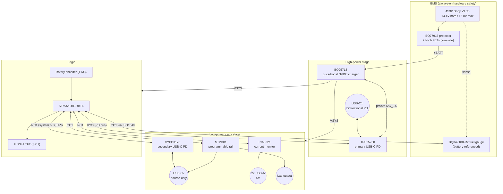

# PCB — KiCad Projects

Two KiCad projects make up the Ducker-Charger hardware:

| Project | Contents |
| --- | --- |
| `Ducker-Charger/` | Main charger board: schematics, PCB layout, production files |
| `Sensing-Board/` | Cell sensing board (tap connections from the 4S pack to the BMS) |

## Main board schematic structure

| Sheet | File | Contents |
| --- | --- | --- |
| Root | `Ducker-Charger.kicad_sch` | Top level, sheet interconnections |
| High power | `high_pow.kicad_sch` | TPS25750 (primary USB-C PD), BQ25713 buck-boost charger, VBUS power path |
| Low power | `low_pow.kicad_sch` | CYPD3175 (secondary USB-C PD), STPD01 programmable rail, USB-A load switches, INA3221 sensing, lab-output switching |
| Logic | `Logic.kicad_sch` | STM32F401RBT6, display/encoder interface, logic supply |
| BMS | `BMS.kicad_sch` | BQ77915 protection, BQ34Z100-R2 fuel gauge, ISO1540 I2C isolator, protection FETs |

> The secondary PD controller is the Infineon **CYPD3175** — it replaced the
> ST **STUSB4710** (EOL).

Component datasheets and technical reference manuals used during the design are
collected in [`Ducker-Charger/docs/`](Ducker-Charger/docs/).

## System block diagram

Bus-level detail (pins, addresses):
[`docs/hardware/BSP_reference.md`](../docs/hardware/BSP_reference.md).

## Production

`*/production/` holds the fabrication outputs (gerber zip + IPC netlist)
generated with the JLCPCB fabrication toolkit. Regenerate after any layout
change — do not hand-edit.
