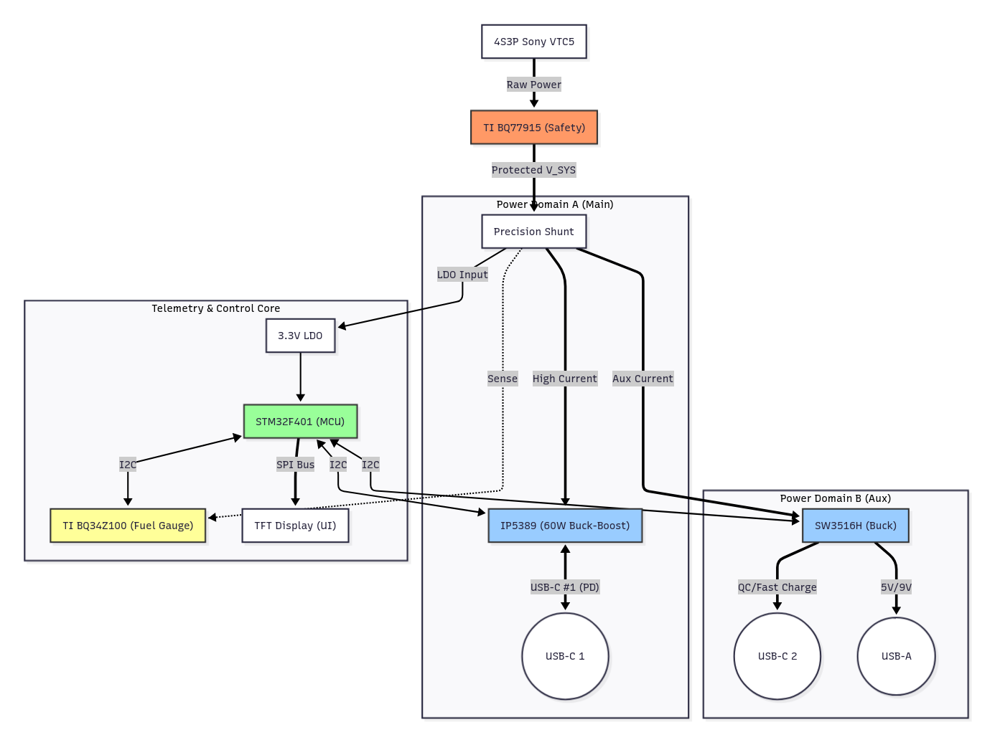

# ⚡ System Architecture & Design Logic
**Project:** 60W+ Smart UPS/Powerbank (4S3P)
**Target:** Embedded Systems Final Project

## System Overview
This document details the architectural decisions for a high-performance, safety-critical Power Management System.
The design moves away from a monolithic structure into a **Distributed Power Architecture**, where Safety, Power Conversion, and Telemetry/Control are handled by specialized, isolated subsystems.

---

## The Energy Source (4S3P)
* **Configuration:** 4 Series x 3 Parallel (12 Cells).
* **Cell Model:** **Sony Murata VTC5** (18650 High-Drain).
* **Specs:** 14.4V Nominal / 16.8V Max / ~115Wh Total Energy.
* **Rational:** A 4S topology reduces the boost ratio required to reach 20V (USB-PD standard), improving thermal efficiency compared to a 3S equivalent.

---

## Layer 1: Hardware Safety
**Philosophy:** *Hardware protection must be autonomous and software-independent.*

### Primary Protection: TI BQ77915
* **Function:** Monitors individual cell voltages and pack current.
* **Mechanism:** Controls low-side N-Channel MOSFETs (**NCE3080K**) to physically disconnect the battery ground (`BATT-`) from the system ground (`PACK-`) in case of faults (OV, UV, Short Circuit).
* **Configuration:** Hard-wired for 4S operation; "Always-On" topology (Hibernate disabled).

---

## Layer 2: Power Conversion Domains
**Philosophy:** *Domain Isolation. Heavy loads on the main port must not destabilize auxiliary ports.*

### Domain A: High-Power PD
* **Controller:** **Injoinic IP5389** (SoC).
* **Role:** Dedicated 60W Buck-Boost Converter for **USB-C Port #1**.
* **Features:** Bidirectional Power Delivery (Source/Sink). Handles the complex PD 3.0 negotiation in hardware.
* **Thermal Safety:** Features a dedicated NTC thermistor placed directly on the PCB power stage.

### Domain B: Auxiliary Power
* **Controller:** **Ismartware SW3516H**.
* **Role:** Dedicated Buck Converter for **USB-C #2** and **USB-A** ports.
* **Purpose:** Provides stable 5V/9V/12V output for peripherals/phones, ensuring that plugging in a secondary device does not trigger a power renegotiation (reset) on the main laptop charging port.

---

## Layer 3: Telemetry & Control Core
**Philosophy:** *Centralized Intelligence. The MCU acts as the data aggregator and HMI driver.*

### 1. The Fuel Gauge (Precision Sensing)
* **Component:** **TI BQ34Z100-R2**.
* **Method:** Impedance Track™.
* **Role:** Measures current across a high-side precision shunt resistor. Unlike simple voltage monitoring, this chip "learns" the battery aging and impedance, providing an accurate "Time-to-Empty" prediction.

### 2. The Microcontroller (The Host)
* **Component:** **STM32F401RBT6** (ARM Cortex-M4).
* **Power:** Fed by a dedicated LDO (3.3V) derived from the protected system bus.
* **Functions:**
    * **I2C Master:** Polls the BQ34Z100 for SoC data and the IP5389/SW3516 for connection status.
    * **Thermal Manager:** Reads auxiliary NTCs distributed across the battery pack.
    * **System Supervisor:** Manages power states and user inputs.

### 3. The Human-Machine Interface (HMI)
* **Display:** **TFT LCD (SPI)**.
* **Driver:** ILI9341 / ST7789.
* **Visualization:** Renders real-time graphs of Voltage, Current, and Power flow, providing immediate feedback on system health.

---

## Logical Block Diagram

