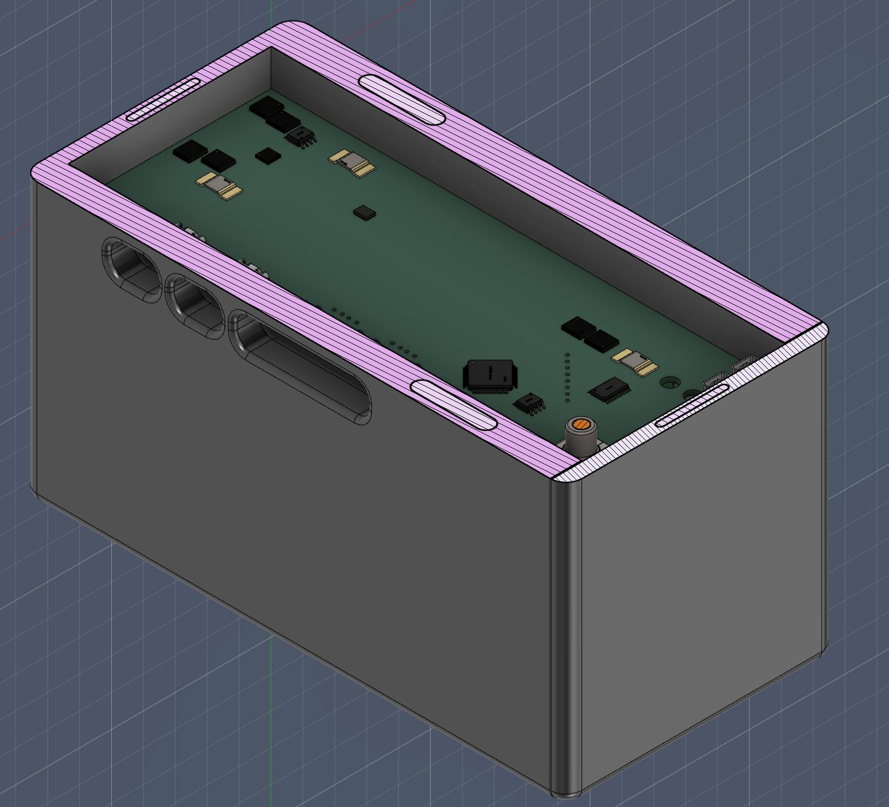

<div align="center">

# ⚡ Ducker-Charger

**A fully custom, open-source smart power bank, designed from scratch.**

*4S3P Li-Ion pack · bidirectional USB-PD · bench-supply output · TFT telemetry UI*


<table>
  <tr>
    <td align="center"></td>
    <td align="center"></td>
  </tr>
  <tr>
    <td align="center"><em>Enclosure (prototype 3, lid off)</em></td>
    <td align="center"><em>Live telemetry UI</em></td>
  </tr>
</table>

</div>

> [!WARNING]
> **Work in progress: the design is not yet validated.** This project involves
> Li-Ion batteries, which can overheat, catch fire, or explode if mishandled.
> Take any information here at your own risk and read the safety note below.

## 🌟 Highlights

* **115 Wh**: 12× 18650 cells (Sony Murata VTC5, 4S3P), 14.4 V nominal / 16.8 V max
* **2× USB-C PD**: primary port is bidirectional (charges the pack *and* powers loads)
* **2× USB-A**: fixed 5 V, individually switchable, current-monitored
* **Lab output**: banana-jack rail that behaves like a bench power supply
* **Hardware-autonomous BMS**: BQ77915 protection works even if all firmware fails
* **STM32F401 supervisor**: power-state FSM, charge management, TFT + rotary-encoder UI
* **On-device gauge calibration**: guided 9-step wizard on the display; a multimeter is the only tool needed (no bqStudio / EV2400)
* **Develop without hardware**: full-PCB emulator, desktop UI simulator, host-side unit tests

## ⚠️ Safety & Disclaimer

* **I assume no liability** for any damage to property, people, or components resulting from the construction or use of this project.
* Always double-check polarity before connecting the batteries.
* Do not attempt to assemble this circuit if you are not experienced in handling lithium batteries.

## 🛠️ Requirements

**Hardware**
* Assembled mainboard + Sensing-Board (`PCB/`)
* 12× 18650 Li-Ion cells, 4S3P (e.g. Sony/Murata VTC5)
* ST-Link V2 (or compatible SWD probe) to flash the STM32F401RBT6
* A USB-PD charger for the primary port, plus USB-C/USB-A cables to exercise the outputs

**Software**
* `arm-none-eabi-gcc`: the firmware builds via the CubeMX-generated `Makefile` in `firmware/cubeMX/`, no IDE required
* `st-flash` (`stlink-tools`) or STM32CubeProgrammer, to flash over SWD
* `gcc` + `SDL2`: only needed for `firmware/emulator/` and `firmware/interface-tester/` (no hardware required to run these)
* Optional: STM32CubeIDE / STM32CubeMX, only to regenerate peripheral init code from `cubeMX.ioc`

## 🧩 Architecture

Distributed design: cell safety, power conversion, PD negotiation and gauging
each live in a dedicated IC; the STM32 supervises, aggregates telemetry and
drives the UI. Block diagram in [`PCB/README.md`](PCB/README.md).

<details>
<summary><strong>Full IC breakdown (10 subsystems)</strong></summary>
<br>

| Subsystem | Part | Role |
|-----------|------|------|
| Safety / Protection | TI **BQ77915** + N-ch MOSFETs | Autonomous, software-independent cell OV/UV/SC/OC cutoff (4S, always-on) |
| Charger | TI **BQ25713** | Buck-boost NVDC battery charger (driven by the TPS25750 on a private I²C bus) |
| Main USB-C PD | TI **TPS25750** | Primary PD port controller; patch bundle streamed by the MCU at every boot |
| Aux USB-C PD | Infineon **CYPD3175** (CCG3PA) | Secondary PD port negotiation (replaced the EOL STUSB4710) |
| Aux programmable rail | ST **STPD01** | I²C-programmable supply for the secondary USB-C / lab output |
| Fuel gauge | TI **BQ34Z100-R2** | Impedance Track™ State-of-Charge / Time-to-Empty |
| Telemetry | TI **INA3221** | 3-channel voltage/current monitoring |
| Step-down | TI **TPS54302 / TPS54202** | Auxiliary rails |
| ESD / I²C isolation | **USBLC6**, **ISO1540** | Port ESD protection, isolated I²C to the battery-referenced gauge |
| Host | **STM32F401RBT6** | I²C master, power-state FSM, thermal manager, HMI / supervisor |

</details>

## 📂 Repository

| Path | Contents |
| --- | --- |
| [`PCB/`](PCB/README.md) | KiCad projects: main board + cell sensing board |
| [`firmware/`](firmware/) | STM32 firmware, PD controller configs, emulator, UI simulator, tests |
| [`docs/`](docs/README.md) | Documentation, start here |
| [`powerbank_enclosure/`](powerbank_enclosure/) | 3D-printable enclosure (F3D, STEP, STL, renders) |

<details>
<summary><strong>Full tree</strong></summary>

```text
Ducker-Charger/
├── PCB/
│   ├── Ducker-Charger/         # Main charger board (schematics, layout, datasheets)
│   └── Sensing-Board/          # Cell sensing board
├── firmware/
│   ├── cubeMX/                 # STM32F401 firmware (FSM, charge mgmt, UI, drivers)
│   ├── TPS25750/               # Primary PD controller config (JSON project + .bin)
│   ├── CYPD3175/               # Secondary PD controller firmware (hex, patches, LED driver)
│   ├── emulator/               # Full-PCB emulator: real firmware vs IC models (SDL)
│   ├── interface-tester/       # Desktop UI simulator (SDL)
│   └── tests/                  # Host-side unit tests (FSM, charge, HPI, math)
├── powerbank_enclosure/        # 3D-printable enclosure (F3D, STEP, STL, renders)
└── docs/
    ├── hardware/               # Power architecture, pin map / BSP reference
    ├── firmware/               # Architecture, FSM, charge mgmt, boot, UI
    └── assets/                 # UI demo gif
```

</details>

## 📖 Documentation

Start from **[`docs/README.md`](docs/README.md)**: full system overview and a
walkthrough of how the firmware works, with links to:

* [Hardware architecture](docs/hardware/Hardware_Architecture.md) · [pin-level BSP reference](docs/hardware/BSP_reference.md)
* [Firmware architecture](docs/firmware/Firmware_Architecture.md) · [power-state FSM](docs/firmware/FSM.md) · [charge management](docs/firmware/Charge_Management.md)
* [Boot & IC provisioning](docs/firmware/Boot_and_Provisioning.md) · [gauge calibration wizard](docs/firmware/Gauge_Calibration.md) · [UI / display reference](docs/firmware/UI_and_Display.md)
* [KiCad projects & block diagram](PCB/README.md)

## 🎮 User Guide

Boots to **MAIN** (battery %, voltage/current, live current graph). Rotate the
encoder to cycle **MAIN → DETAILS → GRAPH → PORTS → STATS**; press to open
**SETTINGS** (per-port toggles, Lab output voltage/current, USB-C2 output
ceiling, lock-all, brightness/auto-sleep, gauge calibration wizard, shutdown).
A long press (or SETTINGS → Shutdown) puts the device into deep sleep; a
short press wakes it back up if a charger is attached. Fault conditions open a
dedicated FAULT screen automatically, naming the cause.

Full screen-by-screen reference: [`docs/firmware/UI_and_Display.md`](docs/firmware/UI_and_Display.md).

## 🎥 Presentation & Demo

* 📊 Slides: [Google Slides](https://docs.google.com/presentation/d/1OwDXiBUUQ08QPd7Jknc45msrt9zxNyJMcGTFnEZxmk4/edit?usp=sharing)
* 🎬 YouTube walkthrough: [youtu.be/msm0JCK7GhI](https://youtu.be/msm0JCK7GhI)

## 👥 Team & Contributions

The project is split by layer, one owner per layer end-to-end (design, implementation, docs, tests):

| Member | Layer owned |
|---|---|
| Angelo Perotti | Hardware (PCB/KiCad), CubeMX project bring-up, boot & IC provisioning |
| Francesco Brunelli | Charge management: sensors, actuators, fault detection |
| Michelangelo Calia | Power-state FSM & fault handling |
| Maya | Display/UI stack: driver, widgets, screens, navigation |

## 🤝 Contributing

Issues, suggestions, and pull requests are momentarily suspended, as this is a university course project.

## 📜 License

Released under the [Creative Commons Attribution-NonCommercial 4.0 Internationalç
License (CC BY-NC 4.0)](LICENSE). © 2026 Angelo Perotti.

You are free to use, modify, and build upon this work for **non-commercial**
purposes, as long as you **credit the author**. See [NOTICE](NOTICE) for
attribution details.
